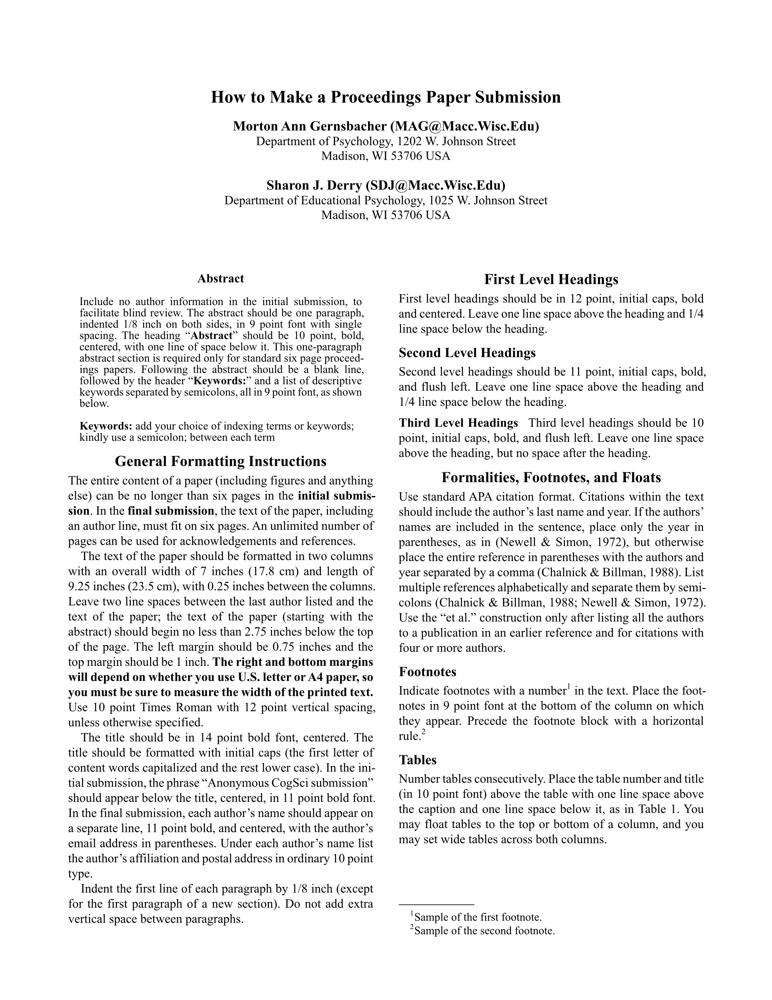

# CogSci Template

A [Typst](https://typst.app/) template for submissions to the _Annual Conference of the [Cognitive Science Society](https://cognitivesciencesociety.org/) (**CogSci**)_.

|                     Anonymized                     |                      Final                      |
| :------------------------------------------------: | :---------------------------------------------: |
|  |  |

## Usage

You will typically want to use this template by initializing a project with the CogSci template. The CogSci template (shown in the thumbnails) will give you the formatting specifications and examples of how to make citations, figures, tables, footnotes, and acknowledgments. You can generate the template (*a*) in the Typst web app or (*b*) locally. If you don't need the template, you can also just (*c*) import the template functions in any Typst document.

### (*a*) Initialize the template in the Typst web app

In the [Typst web app](https://typst.app/), click "Start from template" on the dashboard and search for `cogsci-conference`.

### (*b*) Initialize the template locally

You can use the [Typst CLI](https://github.com/typst/typst) to initialize the template locally:

```shell
typst init @preview/cogsci-conference
cd cogsci-conference
```

### (*c*) Import the template functions

The API is described in the [Parameters](#parameters) section below.

```typst
#import "@preview/cogsci-conference:0.1.1": cogsci, format-authors

#show: cogsci.with(
  title: [CogSci Typst Template],
  author-info: format-authors(
    authors: (
      (name: [Author N. One], email: "a1@uni.edu", super: [1]),
      (name: [Author Number Two], super: [2]),
    ),
    affiliations: (
      (super: [1], affil: [Department of Hypothetical Sciences, University of Illustrations]),
      (super: [2], affil: [Department of Example Studies, University of Demonstrations]),
    ),
  ),
  abstract: [The abstract.],
  keywords: ("kw1", "kw2", "kw3"),
  anonymize: true,
  hyphenate: true,
)

// Document content goes here...

#bibliography("bibliography.bib")
```

### Fonts

This template requires the fonts [TeX Gyre Termes](https://www.gust.org.pl/projects/e-foundry/tex-gyre) and [TeX Gyre Termes Math](https://www.gust.org.pl/projects/e-foundry/tg-math/index_html), which are distributed under the [GUST Font License (GFL)](https://tug.org/fonts/licenses/GUST-FONT-LICENSE.txt). The Typst web app includes these fonts automatically. For local usage, you can install the fonts system-wide or pass the font directory path to the compiler. See the [Typst documentation on fonts](https://typst.app/docs/reference/text/text/#parameters-font) for details.

### Local Usage

If you're using Typst locally, you might find it convenient to use the [Tinymist Typst VS Code Extension](https://marketplace.visualstudio.com/items?itemName=myriad-dreamin.tinymist) (the [Tinymist](https://myriad-dreamin.github.io/tinymist/) extension for [Visual Studio Code](https://code.visualstudio.com/)).

To compile the PDF, use the Typst CLI or the Tinymist extension.

#### Compilation

With the Typst CLI:

```shell
typst compile --font-path <path-to-fonts-dir> --pdf-standard a-3u main.typ main.pdf
```

Specifying a [PDF standard](https://typst.app/docs/reference/pdf/#pdf-standards) like `--pdf-standard a-3u` is optional but ensures the PDF is searchable.

If the fonts are installed system-wide, omit `--font-path`, otherwise use `--font-path <path-to-fonts-dir>` to specify the path to a directory containing the OTF files.

With the VS Code extension, use `"tinymist.fontPaths"` to specify an additional font directory. See the Tinymist [documentation](https://myriad-dreamin.github.io/tinymist/config/vscode.html) for details.

## Important Notes

### Double-Blind Reviewing

Beginning in 2019, 6-page full paper submissions are reviewed double-blind, so submissions must be anonymized. **The policy for double-blind reviews is strictly enforced.** Ensure your submissions are anonymized before submission.

You can toggle the author details in your submission using the [`anonymize`](#submission-control) flag (this also prevents author info from being stored in the PDF metadata).

### Page Limits

In the *initial submission*, full papers can be no longer than six pages plus an unlimited number of pages for references. In the *final submission*, full papers (including the title and authors) can be no longer than six pages plus an unlimited number of pages for acknowledgments and references.

### CC-BY Licensing

An online proceedings will be published by the Cognitive Science Society. At the time of final (camera-ready) submission, authors will be required to agree to release their proceedings contribution under a CC-BY license. This means that authors allow free reuse of their work provided the original authors are attributed.

## Parameters

The `cogsci()` template function accepts the following parameters:

### Document Metadata

- **`title`** (content): The paper title.

- **`author-info`** (content): Pre-formatted author information. The template exports a `format-authors()` helper function that accepts:
  - `authors`: Array of author dictionaries with keys `name`, `email` (optional), and `super` (superscript for affiliation reference)
  - `affiliations`: Array of affiliation dictionaries with keys `super` (matching superscript) and `affil` (affiliation text)

  You can pass your own custom formatted content to `author-info` if you need different styling.

- **`abstract`** (content): The paper abstract.

- **`keywords`** (array): Array of keyword strings.

### Bibliography

Call `bibliography()` at the end of your document:

```typst
#bibliography("bibliography.bib")
```

Typst's `bibliography()` function accepts a BibLaTeX `.bib` file or a Hayagriva `.yaml`/`.yml` file.

**Note:** If passing a `.bib` file, use the Bib***La***TeX format, not BibTeX.

### Submission Control

- **`anonymize`** (boolean): Set to `true` for double-blind review submissions (hides author information and uses "Anonymous CogSci submission" placeholder). Set to `false` for final camera-ready submissions with author details. Default is `false`.

### Formatting Options

- **`hyphenate`** (boolean): Set to `false` to disable hyphenation throughout the document (useful for proofreading). Default is `true`.

### Manual Overrides

The template exposes manual overrides for `text()`, `page()`, and `document()`. It's advised that you not use these. But if you absolutely need to change the region, paper size, or document metadata, then you can override the defaults by supplying a dictionary.

- **`text-kwargs`** (dictionary): expands into `set text(..text-kwargs)`
- **`page-kwargs`** (dictionary): expands into `set page(..page-kwargs)`
- **`document-kwargs`** (dictionary): expands into `set document(..document-kwargs)`

## Preparing an anonymized submission

Set `anonymize` to `true`.

Remember that you need to leave at least 2.75 inches between the top of the first page and the abstract and text of your paper. Since the top margin needs to be 1 inch on all pages, this means that there needs to be at least 1.75 inches of space on page 1 in which nothing but your paper title and **Anonymous CogSci submission** appears. Additionally, please remember not to include acknowledgments in the anonymized version of your paper.

The entire content of your anonymized paper can be no longer than six pages, plus unlimited space for references.

## Preparing the de-anonymized final version of your accepted paper

Set `anonymize` to `false`.

In the final version of the paper, the title, author, abstract, and text of the paper must fit within six pages. Unlimited additional pages can be used for acknowledgments and references. In the final version of the paper for the proceedings (but not the initial anonymized submission), be sure to include any acknowledgments that may be appropriate.

In the *final submission*, the text of the paper, including all figures, tables and author info, must fit on six pages. An unlimited number of pages can be used for acknowledgments and references.

## Requirements

- Typst `v0.14.0` or later (use the [web app](https://typst.app/play/) or [install locally](https://github.com/typst/typst?tab=readme-ov-file#installation), e.g. with `brew install typst`)

## License

This template is distributed under the MIT License.

## Author

[](https://github.com/daeh) [](https://daeh.info) [](https://bsky.app/profile/dae.bsky.social)
